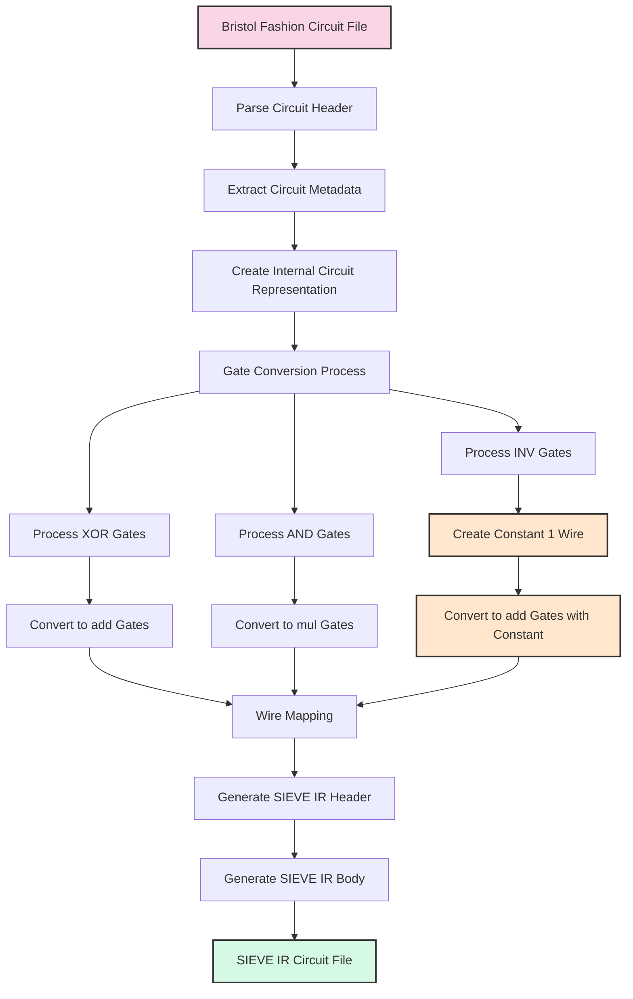

# Bristol to Sieve Transpiler

A tool for compiling Bristol Fashion circuits to SIEVE IR format, enabling the use of Bristol Fashion circuits with zero-knowledge proof systems like schmivitz.

## Complete Example

Bristol Fashion Input
```
3 7
2 1 1
1 1
2 1 0 1 4 XOR
2 1 0 1 5 AND
1 1 1 6 INV
```

SIEVE IR Output
```
version 2.0.0;
circuit;
@type field 2;
@begin
  $0 <- @private(0);    // Constant 1 wire for INV gates
  $1 <- @private(0);    // First input wire
  $2 <- @private(0);    // Second input wire
  $6 <- @add(0: $1, $2); // XOR gate (remapped from wire 4)
  $7 <- @mul(0: $1, $2); // AND gate (remapped from wire 5)
  $8 <- @add(0: $2, $0); // INV gate (remapped from wire 6)
@end
```

## Usage

To convert a Bristol Fashion circuit to SIEVE IR format using the command-line tool:

```bash
cargo run --bin bristol2sieve -- transpile -i path/to/bristol_circuit.txt -o path/to/output_sieve_circuit.txt
```

You can also using bristol2sieve as a library in your Rust project. Here's an example of how to use it:

```rust
use bristol2sieve::transpile;
use eyre::Result;

fn main() -> Result<()> {
    // Specify paths to your Bristol circuit and output Sieve file
    let bristol_path = "path/to/your/circuit.txt";
    let sieve_output_path = "path/to/output/sieve_circuit.txt";
    
    // Convert Bristol format to Sieve format
    transpile(bristol_path, sieve_output_path)?;
    
    println!("Circuit successfully converted to Sieve format!");
    Ok(())
}
```

# Transpiler Specification

This document specifies the requirements and implementation details for transpiling circuits from Bristol Fashion format to SIEVE IR format, with a focus on huge circuits like SHA-256 and Keccak-f.

## 1. Overview 

### 1.1 Purpose

The transpiler converts circuit descriptions from Bristol Fashion format to SIEVE IR format, enabling the use of Bristol Fashion circuits with the schmivitz VOLE-in-the-head zero-knowledge proof system.

### 1.2 Supported Circuits

The transpiler is designed to support circuits that use the following gates:
- XOR gates
- AND gates
- INV gates

Circuits that use EQ or EQW gates are not directly supported, as these gates cannot be directly expressed in SIEVE IR.



## 2. Detailed Process Description

### 2.1. Input Processing

- **Read Bristol Fashion Circuit File**: Parse the file containing the circuit description in Bristol Fashion format
- **Extract Circuit Metadata**: Determine the number of gates, wires, inputs, and outputs
- **Create Internal Circuit Representation**: Build a data structure representing the circuit

### 2.2. Gate Conversion

- **Process XOR Gates**: Identify all XOR gates in the circuit
  - **Convert to add Gates**: Map each XOR gate to an add gate in SIEVE IR
  
- **Process AND Gates**: Identify all AND gates in the circuit
  - **Convert to mul Gates**: Map each AND gate to a mul gate in SIEVE IR
  
- **Process INV Gates**: Identify all INV gates in the circuit
  - **Create Constant 1 Wire**: Create a dedicated private input wire with value 1
  - **Convert to add Gates with Constant**: Map each INV gate to an add gate with the constant 1 wire

The following table describes how each Bristol Fashion gate is mapped to SIEVE IR:

| Bristol Fashion Gate | SIEVE IR Equivalent | Implementation |
|---------------------|---------------------|----------------|
| XOR { a, b, out }   | add                 | `$out' <- @add(0: $a', $b')` |
| AND { a, b, out }   | mul                 | `$out' <- @mul(0: $a', $b')` |
| INV { a, out }      | add with constant 1 | `$out' <- @add(0: $a', $0)` |

Note: `$a'`, `$b'`, and `$out'` represent the remapped wire IDs in SIEVE IR.


XOR Gate Conversion
```
Bristol Fashion:
2 1 0 1 4 XOR    // Wire 4 = Wire 0 XOR Wire 1

SIEVE IR:
// Assuming a circuit with 3 gates and 2 inputs
$6 <- @add(0: $1, $2);  // Wire IDs are remapped
```

AND Gate Conversion
```
Bristol Fashion:
2 1 0 1 5 AND    // Wire 5 = Wire 0 AND Wire 1

SIEVE IR:
// Assuming a circuit with 3 gates and 2 inputs
$7 <- @mul(0: $1, $2);  // Wire IDs are remapped
```

INV Gate Conversion
```
Bristol Fashion:
1 1 1 6 INV       // Wire 6 = NOT Wire 1

SIEVE IR:
// First, create a constant 1 wire (at the beginning of the circuit)
$0 <- @private(0);  // This input must always be set to 1

// Then, for the INV gate (assuming a circuit with 3 gates and 2 inputs)
$8 <- @add(0: $2, $0);  // NOT(a) = a ⊕ 1 in F2

```

### 2.3. Output Generation

- **Wire Mapping**: Map Bristol Fashion wire IDs to SIEVE IR wire IDs using a collision-avoidance strategy
- **Generate SIEVE IR Header**: Create the SIEVE IR header with type information
- **Generate SIEVE IR Body**: Create the SIEVE IR body with all converted gates
- **Output SIEVE IR Circuit File**: Write the complete SIEVE IR circuit to a file


## 3. Transpilation Process

The transpilation process consists of the following steps:

### 3.1 Parse Bristol Fashion Circuit

1. Read the Bristol Fashion circuit file
2. Parse the header information (number of gates, wires, inputs, outputs)
3. Parse each gate definition

### 3.2 Create SIEVE IR Circuit

1. Generate SIEVE IR header with appropriate type information (field F2)
2. Create a constant 1 wire for INV operations (using private input)
3. Convert each gate according to the mapping rules
4. Handle input and output wires appropriately

### 3.3 Output SIEVE IR

1. Generate the SIEVE IR text representation
2. Optionally convert to flatbuffer binary format

## 4. Implementation Details

### 4.1 Constant Wire Creation

For INV gates, a constant 1 wire is required. This is implemented using a dedicated private input:

```
// Create a constant 1 wire
$0 <- @private(0);  // This input must always be set to 1
```

The private input stream must be configured to always provide a 1 for this wire.

### 4.2 Wire Mapping

Wire IDs from Bristol Fashion are NOT mapped directly to SIEVE IR wire IDs. Instead, a more sophisticated approach is used to prevent wire ID collisions:

1. The constant 1 wire is assigned ID 0
2. Input wires are assigned consecutive IDs starting from 1
3. Gate output wires are assigned new IDs starting from `current_wire + bristol.gates.len()` to avoid collisions

This approach ensures that there are no wire ID collisions, even in complex circuits with many gates.


## 5. Limitations and Considerations

### 5.1 Unsupported Gates

The transpiler does not directly support EQ and EQW gates from Bristol Fashion, as these cannot be directly expressed in SIEVE IR:

- EQ gates (constant outputs) would require a constant gate, which is not supported in SIEVE IR
- EQW gates (wire copies) would require a copy gate, which is not supported in SIEVE IR

### 5.2 Circuit Validation

Before transpilation, the circuit should be validated to ensure it only uses supported gates (XOR, AND, INV).

The transpiled circuits should be validated by:
1. Comparing the outputs of the original Bristol Fashion circuit and the transpiled SIEVE IR circuit for the same inputs
2. Verifying that the transpiled circuit can be successfully used with the schmivitz VOLE-in-the-head system

