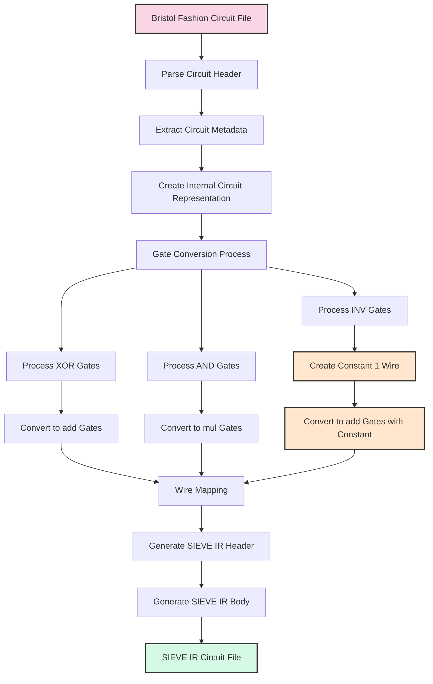

# Bristol Fashion to SIEVE IR Transpiler Specification

This document specifies the requirements and implementation details for transpiling circuits from Bristol Fashion format to SIEVE IR format, with a focus on cryptographic circuits like SHA-256 and Keccak-f.

## 1. Overview
# Bristol Fashion to SIEVE IR Transpilation Process

## Flowchart



## Detailed Process Description

### 1. Input Processing
- **Read Bristol Fashion Circuit File**: Parse the file containing the circuit description in Bristol Fashion format
- **Extract Circuit Metadata**: Determine the number of gates, wires, inputs, and outputs
- **Create Internal Circuit Representation**: Build a data structure representing the circuit

### 2. Gate Conversion
- **Process XOR Gates**: Identify all XOR gates in the circuit
  - **Convert to add Gates**: Map each XOR gate to an add gate in SIEVE IR
  
- **Process AND Gates**: Identify all AND gates in the circuit
  - **Convert to mul Gates**: Map each AND gate to a mul gate in SIEVE IR
  
- **Process INV Gates**: Identify all INV gates in the circuit
  - **Create Constant 1 Wire**: Create a dedicated private input wire with value 1
  - **Convert to add Gates with Constant**: Map each INV gate to an add gate with the constant 1 wire

### 3. Output Generation
- **Wire Mapping**: Ensure consistent wire IDs between Bristol Fashion and SIEVE IR
- **Generate SIEVE IR Header**: Create the SIEVE IR header with type information
- **Generate SIEVE IR Body**: Create the SIEVE IR body with all converted gates
- **Output SIEVE IR Circuit File**: Write the complete SIEVE IR circuit to a file

## Gate Conversion Examples

### XOR Gate Conversion
```
Bristol Fashion:
2 1 XOR 10 11 20    // Wire 20 = Wire 10 XOR Wire 11

SIEVE IR:
$20 <- @add(0: $10, $11);
```

### AND Gate Conversion
```
Bristol Fashion:
2 1 AND 12 13 21    // Wire 21 = Wire 12 AND Wire 13

SIEVE IR:
$21 <- @mul(0: $12, $13);
```

### INV Gate Conversion
```
Bristol Fashion:
1 1 INV 14 22       // Wire 22 = NOT Wire 14

SIEVE IR:
// First, create a constant 1 wire (at the beginning of the circuit)
$0 <- @private(0);  // This input must always be set to 1

// Then, for the INV gate
$22 <- @add(0: $14, $0);  // NOT(a) = a ⊕ 1 in F2
```

## Complete Example

### Bristol Fashion Input
```
4 7
2 1 2 1
1 1
2 1 XOR 0 1 4
2 1 AND 0 1 5
1 1 INV 1 6
```

### SIEVE IR Output
```
version 2.0.0;
circuit;
@type field 2;
@begin
  $0 ... $1 <- @private(0);  // Original inputs
  $2 <- @private(0);         // Constant 1 for INV gates
  $4 <- @add(0: $0, $1);     // XOR gate
  $5 <- @mul(0: $0, $1);     // AND gate
  $6 <- @add(0: $1, $2);     // INV gate
@end
```

### 1.1 Purpose

The transpiler converts circuit descriptions from Bristol Fashion format to SIEVE IR format, enabling the use of Bristol Fashion circuits with the schmivitz VOLE-in-the-head zero-knowledge proof system.

### 1.2 Supported Circuits

The transpiler is designed to support circuits that use the following gates:
- XOR gates
- AND gates
- INV gates

Circuits that use EQ or EQW gates are not directly supported, as these gates cannot be directly expressed in SIEVE IR.

## 2. Gate Mapping

The following table describes how each Bristol Fashion gate is mapped to SIEVE IR:

| Bristol Fashion Gate | SIEVE IR Equivalent | Implementation |
|---------------------|---------------------|----------------|
| XOR { a, b, out }   | add                 | `$out <- @add(0: $a, $b)` |
| AND { a, b, out }   | mul                 | `$out <- @mul(0: $a, $b)` |
| INV { a, out }      | add with constant 1 | `$out <- @add(0: $a, $one_wire)` |

### 2.1 XOR Gate

XOR gates map directly to `add` gates in SIEVE IR because in binary fields (F2), XOR and addition are equivalent operations.

### 2.2 AND Gate

AND gates map directly to `mul` gates in SIEVE IR because in binary fields (F2), AND and multiplication are equivalent operations.

### 2.3 INV Gate

INV gates are implemented using `add` gates with a constant 1 wire. This works because in binary fields (F2), NOT(a) = a ⊕ 1.

The constant 1 wire is created using a dedicated private input that is always set to 1:
```
$one_wire <- @private(0);  // This input must always be set to 1
```

## 3. Transpilation Process

The transpilation process consists of the following steps:

### 3.1 Parse Bristol Fashion Circuit

1. Read the Bristol Fashion circuit file
2. Parse the header information (number of gates, wires, inputs, outputs)
3. Parse each gate definition

### 3.2 Create SIEVE IR Circuit

1. Generate SIEVE IR header with appropriate type information (field F2)
2. Create a constant 1 wire for INV operations (using private input)
3. Convert each gate according to the mapping rules
4. Handle input and output wires appropriately

### 3.3 Output SIEVE IR

1. Generate the SIEVE IR text representation
2. Optionally convert to flatbuffer binary format

## 4. Implementation Details

### 4.1 Constant Wire Creation

For INV gates, a constant 1 wire is required. This is implemented using a dedicated private input:

```
// Create a constant 1 wire
$one_wire <- @private(0);  // This input must always be set to 1
```

The private input stream must be configured to always provide a 1 for this wire.

### 4.2 Wire Mapping

Wire IDs from Bristol Fashion are mapped directly to SIEVE IR wire IDs, with the exception of the constant 1 wire which is created specifically for INV operations.

### 4.3 Example Transformation

Bristol Fashion:
```
2 1 XOR 10 11 20    // Wire 20 = Wire 10 XOR Wire 11
2 1 AND 12 13 21    // Wire 21 = Wire 12 AND Wire 13
1 1 INV 14 22       // Wire 22 = NOT Wire 14
```

SIEVE IR:
```
// Header
version 2.0.0;
circuit;
@type field 2;
@begin

// Create constant 1 for INV operations
$0 <- @private(0);  // Always set to 1

// XOR gate
$20 <- @add(0: $10, $11);

// AND gate
$21 <- @mul(0: $12, $13);

// INV gate
$22 <- @add(0: $14, $0);

@end
```

## 5. Limitations and Considerations

### 5.1 Unsupported Gates

The transpiler does not directly support EQ and EQW gates from Bristol Fashion, as these cannot be directly expressed in SIEVE IR:

- EQ gates (constant outputs) would require a constant gate, which is not supported in SIEVE IR
- EQW gates (wire copies) would require a copy gate, which is not supported in SIEVE IR

### 5.2 Circuit Validation

Before transpilation, the circuit should be validated to ensure it only uses supported gates (XOR, AND, INV).

### 5.3 Performance Considerations

The transpilation process should be optimized for large circuits like SHA-256 and Keccak-f, which can contain thousands of gates.

## 6. Testing

### 6.1 Test Cases

The transpiler should be tested with the following circuits:
- SHA-256
- Keccak-f
- Simple test circuits with known outputs

### 6.2 Validation

The transpiled circuits should be validated by:
1. Comparing the outputs of the original Bristol Fashion circuit and the transpiled SIEVE IR circuit for the same inputs
2. Verifying that the transpiled circuit can be successfully used with the schmivitz VOLE-in-the-head system

## 7. Conclusion

This specification provides the requirements and implementation details for transpiling Bristol Fashion circuits to SIEVE IR format. By following this specification, it is possible to use Bristol Fashion circuits with the schmivitz VOLE-in-the-head zero-knowledge proof system, enabling the creation of efficient zero-knowledge proofs for cryptographic operations like SHA-256 and Keccak-f.

