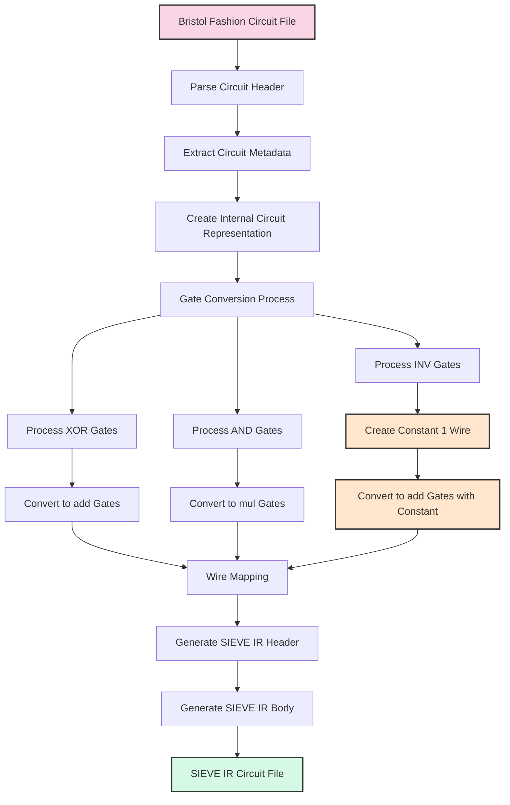

# Bristol Fashion to SIEVE IR Transpilation Process

## Flowchart



## Detailed Process Description

### 1. Input Processing
- **Read Bristol Fashion Circuit File**: Parse the file containing the circuit description in Bristol Fashion format
- **Extract Circuit Metadata**: Determine the number of gates, wires, inputs, and outputs
- **Create Internal Circuit Representation**: Build a data structure representing the circuit

### 2. Gate Conversion
- **Process XOR Gates**: Identify all XOR gates in the circuit
  - **Convert to add Gates**: Map each XOR gate to an add gate in SIEVE IR
  
- **Process AND Gates**: Identify all AND gates in the circuit
  - **Convert to mul Gates**: Map each AND gate to a mul gate in SIEVE IR
  
- **Process INV Gates**: Identify all INV gates in the circuit
  - **Create Constant 1 Wire**: Create a dedicated private input wire with value 1
  - **Convert to add Gates with Constant**: Map each INV gate to an add gate with the constant 1 wire

### 3. Output Generation
- **Wire Mapping**: Ensure consistent wire IDs between Bristol Fashion and SIEVE IR
- **Generate SIEVE IR Header**: Create the SIEVE IR header with type information
- **Generate SIEVE IR Body**: Create the SIEVE IR body with all converted gates
- **Output SIEVE IR Circuit File**: Write the complete SIEVE IR circuit to a file

## Gate Conversion Examples

### XOR Gate Conversion
```
Bristol Fashion:
2 1 XOR 10 11 20    // Wire 20 = Wire 10 XOR Wire 11

SIEVE IR:
$20 <- @add(0: $10, $11);
```

### AND Gate Conversion
```
Bristol Fashion:
2 1 AND 12 13 21    // Wire 21 = Wire 12 AND Wire 13

SIEVE IR:
$21 <- @mul(0: $12, $13);
```

### INV Gate Conversion
```
Bristol Fashion:
1 1 INV 14 22       // Wire 22 = NOT Wire 14

SIEVE IR:
// First, create a constant 1 wire (at the beginning of the circuit)
$0 <- @private(0);  // This input must always be set to 1

// Then, for the INV gate
$22 <- @add(0: $14, $0);  // NOT(a) = a ⊕ 1 in F2
```

## Complete Example

### Bristol Fashion Input
```
4 7
2 1 2 1
1 1
2 1 XOR 0 1 4
2 1 AND 0 1 5
1 1 INV 1 6
```

### SIEVE IR Output
```
version 2.0.0;
circuit;
@type field 2;
@begin
  $0 ... $1 <- @private(0);  // Original inputs
  $2 <- @private(0);         // Constant 1 for INV gates
  $4 <- @add(0: $0, $1);     // XOR gate
  $5 <- @mul(0: $0, $1);     // AND gate
  $6 <- @add(0: $1, $2);     // INV gate
@end
